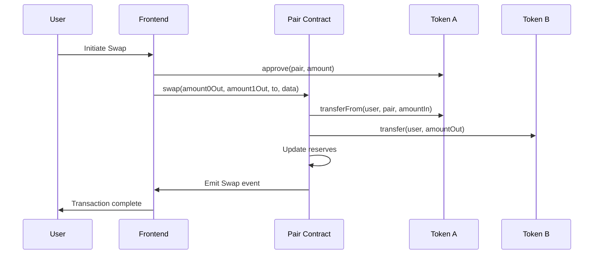
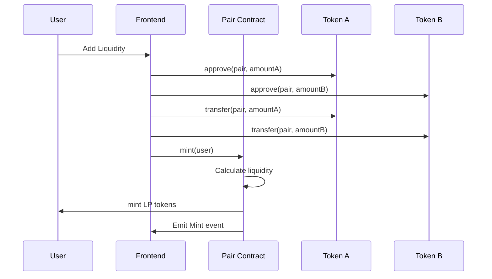

# 📖 TÀI LIỆU KỸ THUẬT - UNISWAP V2 DEX

## 🏗️ KIẾN TRÚC SMART CONTRACTS

### 1. UniswapV2Factory Contract

**Chức năng chính:**
- Tạo và quản lý các pair contracts
- Quản lý phí giao dịch (fee management)
- Lưu trữ danh sách tất cả các pairs

**Key Functions:**
```solidity
function createPair(address tokenA, address tokenB) external returns (address pair)
function getPair(address tokenA, address tokenB) external view returns (address pair)
function allPairs(uint) external view returns (address pair)
function allPairsLength() external view returns (uint)
function setFeeTo(address) external
function setFeeToSetter(address) external
```

**Deployment Pattern:**
- Sử dụng CREATE2 opcode để tạo deterministic addresses
- Pair address có thể được tính toán trước khi deploy

### 2. UniswapV2Pair Contract

**Chức năng chính:**
- Thực hiện logic swap tokens
- Quản lý thanh khoản (mint/burn LP tokens)
- Tính toán và thu phí giao dịch
- Implement constant product formula: `x * y = k`

**Key Functions:**
```solidity
function swap(uint amount0Out, uint amount1Out, address to, bytes calldata data) external
function mint(address to) external returns (uint liquidity)
function burn(address to) external returns (uint amount0, uint amount1)
function sync() external
function getReserves() external view returns (uint112 reserve0, uint112 reserve1, uint32 blockTimestampLast)
```

**Core Mechanics:**
- **Swap Formula**: `amount_out = (amount_in * 997 * reserve_out) / (reserve_in * 1000 + amount_in * 997)`
- **LP Token Calculation**: `liquidity = sqrt(amount0 * amount1) - MINIMUM_LIQUIDITY`
- **Fee**: 0.3% trên mỗi giao dịch (30 basis points)

### 3. UniswapV2ERC20 Contract

**Chức năng chính:**
- Implement chuẩn ERC20 cho LP tokens
- Hỗ trợ permit functionality (EIP-2612)
- Gas-efficient transfers và approvals

**Key Features:**
```solidity
string public constant name = "Uniswap V2"
string public constant symbol = "UNI-V2"
uint8 public constant decimals = 18
function permit(address owner, address spender, uint value, uint deadline, uint8 v, bytes32 r, bytes32 s) external
```

### 4. WETH Contract

**Chức năng chính:**
- Wrap/unwrap ETH thành ERC20 token
- Cho phép ETH tham gia vào pools như một ERC20 token

## 🔄 FLOW DIAGRAM

### Swap Flow


### Add Liquidity Flow


## 🧮 TOÁN HỌC VÀ CÔNG THỨC

### 1. Constant Product Formula
```
x * y = k
```
Trong đó:
- `x`, `y`: Số lượng token trong pool
- `k`: Hằng số (constant product)

### 2. Swap Calculation
```
Δy = (Δx * y * 997) / (x * 1000 + Δx * 997)
```
Trong đó:
- `Δx`: Input amount
- `Δy`: Output amount  
- Fee = 0.3% (997/1000 = 99.7%)

### 3. Liquidity Calculation

**First Liquidity Provider:**
```
liquidity = sqrt(amount0 * amount1) - MINIMUM_LIQUIDITY
```

**Subsequent Liquidity Providers:**
```
liquidity = min(
    (amount0 * totalSupply) / reserve0,
    (amount1 * totalSupply) / reserve1
)
```

### 4. Price Calculation
```
price0 = reserve1 / reserve0
price1 = reserve0 / reserve1
```

## 🛡️ SECURITY CONSIDERATIONS

### 1. Reentrancy Protection
- Sử dụng checks-effects-interactions pattern
- Lock mechanisms trong các function quan trọng

### 2. Integer Overflow/Underflow
- Sử dụng SafeMath library cho phép toán
- Solidity 0.8+ có built-in overflow protection

### 3. Flash Loan Attacks
- Time-weighted average price (TWAP) oracle
- Minimum liquidity lock để prevent pool draining

### 4. Front-running Protection
- Slippage tolerance cho users
- Transaction ordering protection

## 🔧 DEPLOYMENT CONFIGURATION

### Network Configuration
```javascript
// hardhat.config.js
networks: {
  paseoAssetHub: { 
    polkavm: true,
    url: "https://testnet-passet-hub-eth-rpc.polkadot.io/",
    accounts: [process.env.AH_PRIV_KEY],
  }
}
```

### Gas Optimization
- Packed structs để save storage slots
- Efficient algorithms cho swap calculations
- Minimal external calls

## 📊 CONTRACT INTERACTIONS

### Factory → Pair Relationship
```
Factory
├── createPair(tokenA, tokenB)
├── stores: getPair[tokenA][tokenB] = pairAddress
└── tracks: allPairs[] = pairAddress

Pair
├── initialize(token0, token1) // Called by Factory
├── handles: mint, burn, swap
└── emits: Mint, Burn, Swap, Sync events
```

### Token Approval Flow
```
User → approve() → Token Contract
User → transferFrom() → Pair Contract
Pair → handles tokens internally
```

## 🧪 TESTING FRAMEWORK

### Unit Tests Structure
```
test/
├── UniswapV2Factory.js      // Factory contract tests
├── UniswapV2Pair.js         // Pair contract tests  
├── UniswapV2ERC20.js        // ERC20 functionality tests
└── shared/
    └── fixtures.js          // Common test utilities
```

### Test Categories
1. **Factory Tests**: Pair creation, fee management
2. **Pair Tests**: Swap mechanics, liquidity management
3. **ERC20 Tests**: Token transfers, approvals, permit
4. **Integration Tests**: Full DEX workflow

## 📈 MONITORING & ANALYTICS

### Events to Track
```solidity
// Factory Events
event PairCreated(address indexed token0, address indexed token1, address pair, uint);

// Pair Events  
event Mint(address indexed sender, uint amount0, uint amount1);
event Burn(address indexed sender, uint amount0, uint amount1, address indexed to);
event Swap(address indexed sender, uint amount0In, uint amount1In, uint amount0Out, uint amount1Out, address indexed to);
event Sync(uint112 reserve0, uint112 reserve1);
```

### Key Metrics
- Total Value Locked (TVL)
- Trading volume (24h, 7d, 30d)
- Number of active pairs
- Fee generation
- Liquidity provider rewards

## 🚀 OPTIMIZATION STRATEGIES

### Gas Optimization
1. **Batch Operations**: Combine multiple operations
2. **Storage Packing**: Pack variables into single storage slots
3. **Short-circuit Logic**: Early returns trong conditions
4. **Minimal External Calls**: Reduce cross-contract calls

### Performance Optimization
1. **Efficient Algorithms**: Optimal swap calculations
2. **Caching**: Store frequently accessed data
3. **Event Indexing**: Proper event indexing cho analytics
4. **Code Size**: Minimize contract size

---

## 📝 DEVELOPMENT NOTES

### Important Constants
```solidity
uint public constant MINIMUM_LIQUIDITY = 10**3;  // 1000 wei minimum
uint private constant MAX_UINT256 = 2**256 - 1;
```

### Development Best Practices
1. Always test với edge cases
2. Use events cho off-chain monitoring  
3. Implement proper access controls
4. Document all public functions
5. Follow Solidity style guide

**💡 Tip**: Luôn kiểm tra contract addresses sau khi deploy và verify trên block explorer! 